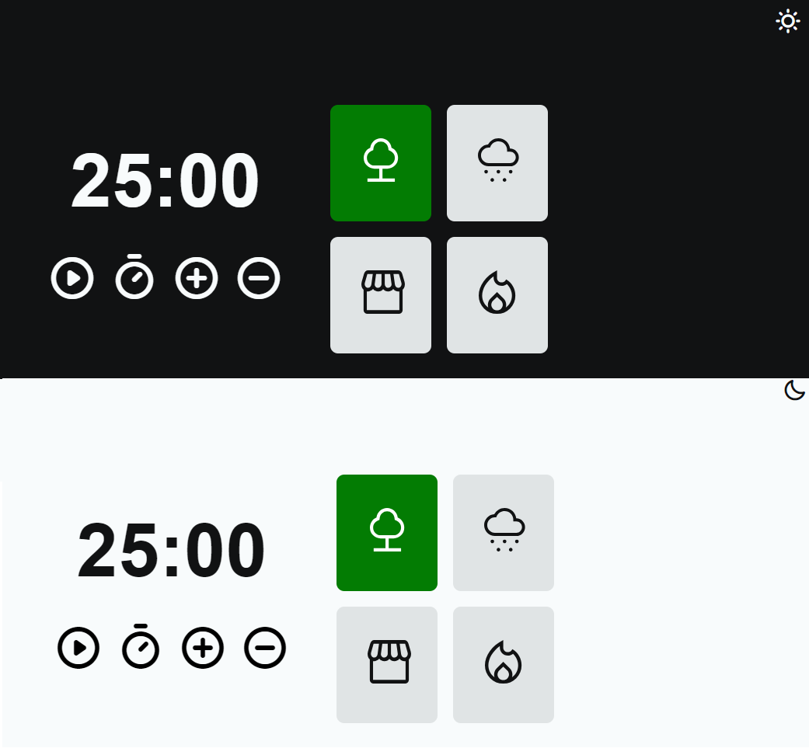

<h1 align="center">
    Focus Timer 2.0 ⏱
</h1>

  <a href="#-layout">Layout</a>&nbsp;&nbsp;&nbsp;|&nbsp;&nbsp;&nbsp;
  <a href="#-Project">Project</a>&nbsp;&nbsp;&nbsp;|&nbsp;&nbsp;&nbsp;
  <a href="#-Technologies">Technologies</a>

## 🔖 Layout

    
    <h3><a href="https://www.figma.com/file/GVX001bLZ1WIVc3OPyi4cw/Stage-05---Focus-Timer-2.0-(Copy)?mode=dev">Click to access the project</a></h3> 

 

## 💻 Project
The Focus Timer Project can be used to manage your time in any type of activity!

### Features:
- Light/dark mode
- Reset clock
- Stop sound when time is up
- Play/stop 4 types of relaxing music
- Button to add or decrease 5 minutes on the timer

## 🚀 Technologies
- HTML
- CSS
- JavaScript

 

    Made with 💙 by <a href="https://www.linkedin.com/in/luis-loschi/">Luis Loschi</a>

