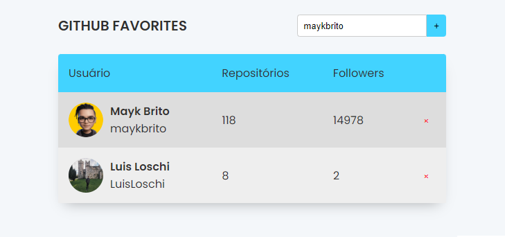

<h1 align="center">
    GITFAV ✨
</h1>

  <a href="#-layout">Layout</a>&nbsp;&nbsp;&nbsp;|&nbsp;&nbsp;&nbsp;
  <a href="#-Project">Project</a>&nbsp;&nbsp;&nbsp;|&nbsp;&nbsp;&nbsp;
  <a href="#-Technologies">Technologies</a>

## 🔖 Layout

    

 

## 💻 Project
The GitFav project allows you to add and save your favorite github users!

### 💡 Features:
- SPA concepts (single-page application)
- Async and promises
- Object orientation (OOP)
- Classes
- Github API
- Node server

## 🚀 Technologies
- HTML
- CSS
- JavaScript

 

    Made with 💙 by <a href="https://www.linkedin.com/in/luis-loschi/">Luis Loschi</a>

