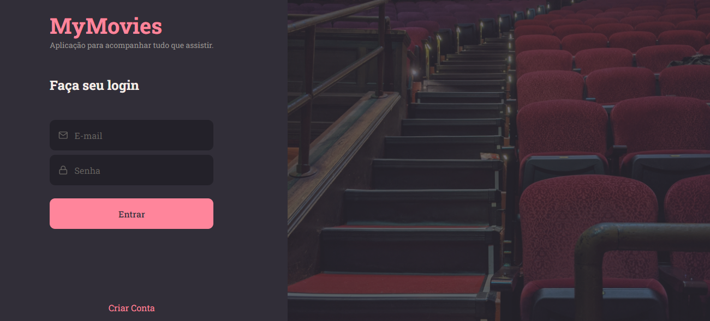
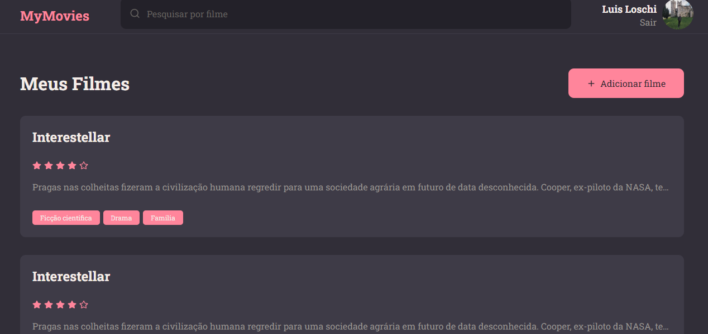

<h1 align="center">
    MyMovies 🎬
</h1>

<p align="center">
  <a href="#-Application">Application</a>&nbsp;&nbsp;&nbsp;|&nbsp;&nbsp;&nbsp;
  <a href="#-Project">Project</a>&nbsp;&nbsp;&nbsp;|&nbsp;&nbsp;&nbsp;
  <a href="#-Technologies">Technologies</a>
</p>

## 🔖 Application

<div align="center">
    <p>Login</p>
    
    <p>App</p>
    
</div>

<br>

## 💻 Project
In this project the challenge was to create an Interface using ReactJS to manage the AppMovie Frontend.

## 📝 Running project
To run this project you need to download <a href="https://nodejs.org/en">NodeJs</a>.

1.  Download the project zip and access <strong>Nivel 9</strong> folder or clone this reposiroty:
```
git clone https://github.com/LuisLoschi/FullStack-Rocketseat-Explorer-course.git
```

2.  Run the project:
```
npm run dev
```

## 🚀 Technologies
- HTML
- CSS
- JavaScript
- React JS

<br>

<p align="center">
    Made with 💙 by <a href="https://www.linkedin.com/in/luis-loschi/">Luis Loschi</a>
</p>