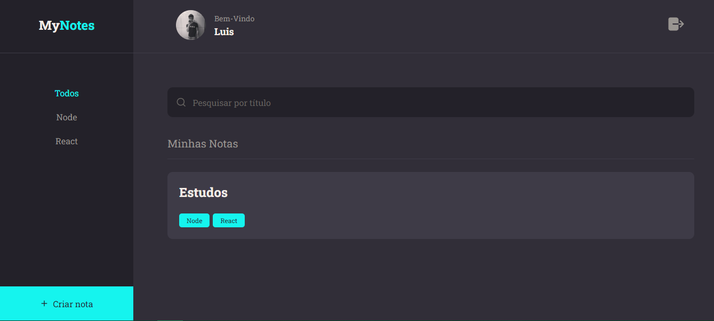

<h1 align="center">
    MyNotes - Fullstack project ⚙
</h1>

<p align="center">
  <a href="#-Application">Application</a>&nbsp;&nbsp;&nbsp;|&nbsp;&nbsp;&nbsp;
  <a href="#-Project">Project</a>&nbsp;&nbsp;&nbsp;|&nbsp;&nbsp;&nbsp;
  <a href="#-Technologies">Technologies</a>
</p>

## 🔖 Application

<div align="center">
    <p>Login</p>
    
    <p>App</p>
    
</div>

<br>

## 💻 Project
Project Name: MyNotes

<strong>MyNotes</strong> simplifies task management with its intuitive note-taking interface. Combining front-end and back-end development, along with RESTful API connections, it offers seamless organization and connectivity for users.

#### 📅 Future improvements:
- [ ] Responsive
- [ ] Light theme

## 📝 Running project
To run this project you need to download <a href="https://nodejs.org/en">NodeJs</a>.

1.  Download the project zip and access <strong>Nivel 10</strong> folder or clone this reposiroty:
```
git clone https://github.com/LuisLoschi/FullStack-Rocketseat-Explorer-course.git
```

2.  Run the frontend on port 5173:
```
npm run dev
```

3.  Run the backend on port 3333:
```
npm start
```

### 💡 Features:
### Frontend
- Hook
- Upload Images
- Components
- Pages
- Styled-components


### Backend
- Authentication
- Local Storage
- Middleware and exceptions
- Routes
- Controllers
- Database manipulation
- Migrations
- Query builder 
- Password encryption
- CRUD
- API ResTful

## 🚀 Technologies
- HTML
- CSS
- JavaScript
- NodeJS
- React JS
- Vite
- Axios
- Express
- SQL

<br>

<p align="center">
    Made with 💙 by <a href="https://www.linkedin.com/in/luis-loschi/">Luis Loschi</a>
</p>